# 细胞的基本结构

## 细胞器和细胞核

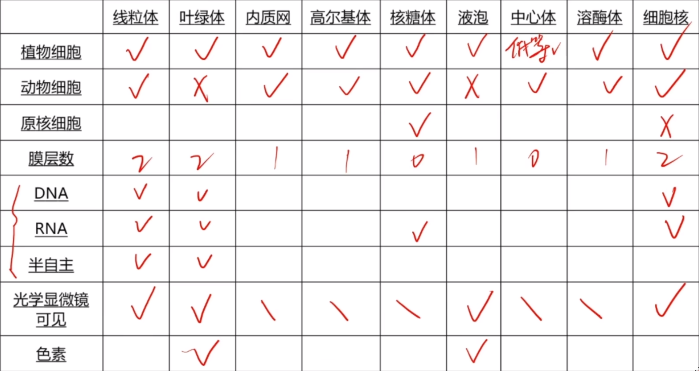

1. 细胞质基质

   1. 状态：透明的胶状物，处于流动状态
   2. 功能：活细胞**新陈代谢**的场所，为活细胞的形成代谢提供物质和环境条件

2. 细胞骨架

   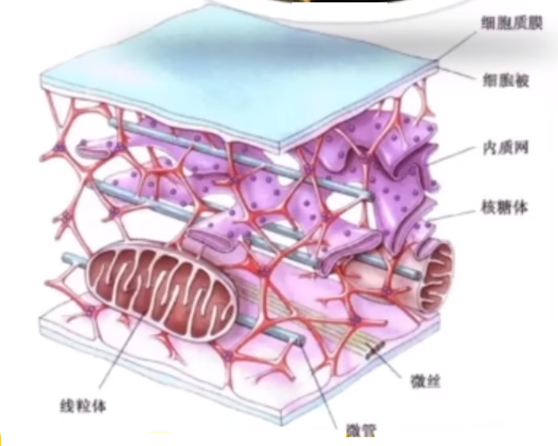

   1. 成分：由**蛋白质纤维**构成的网架结构
   2. 与细胞运动、分裂、分化和物质运输、能量转化、信息传递等生命活动密切相关. 如*马达蛋白*会在细胞骨架上进行物质运输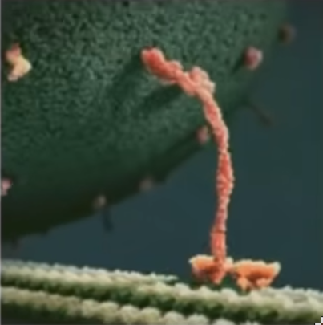

分泌蛋白的分泌流程：

```mermaid
graph
氨基酸 --脱水缩合--> 多肽链 --盘曲折叠--> 蛋白质 --分泌-->细胞外
```

### 细胞器 

#### 核糖体（无膜）

由蛋白质和RNA构成

是**合成蛋白质**的场所

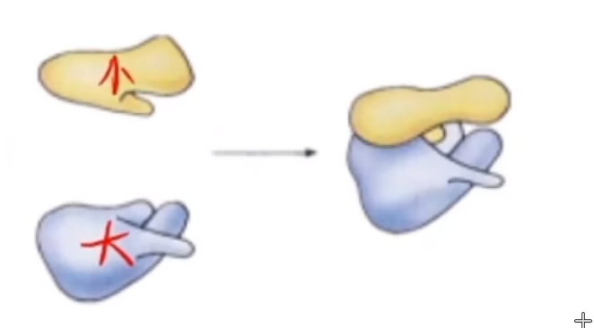

由大亚基和小亚基组成

==其主要负责将氨基酸通过脱水缩合变成多肽==

核糖体分为两种：

1. 游离的核糖体
1. 固着的核糖体

合成多肽的过程中，游离的核糖体逐渐向**内质网**靠拢变成固着的核糖体

所以分泌蛋白的合成主要和**固着的核糖体**有关，而胞内蛋白则完全是**游离的核糖体**完成

在众多细胞器中，其结构位置在：

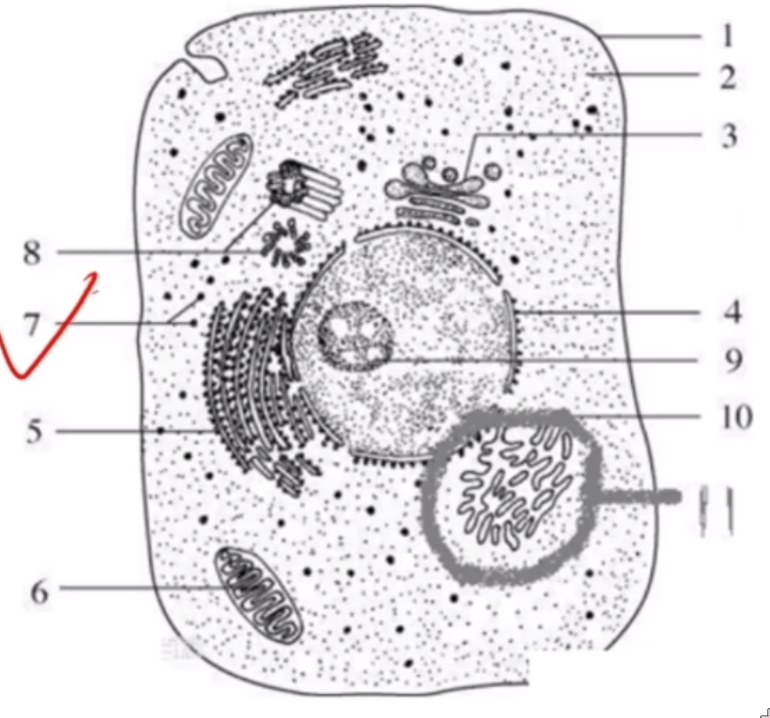

#### 内质网（单层膜）

单层膜构成的网状结构：

内质网分为：

1. 粗面型内质网（有核糖体附着）：与蛋白质的**加工**有关，将蛋白质进行初步的盘曲折叠
2. 光面型内质网（无核糖体附着）：**脂质**的合成

在众多细胞器中，其空间和结构：

5为粗面型，11为光面型

#### 高尔基体（单层膜）

单层膜围成的扁平膜和囊泡

和内质网长得很像，不同的是它有很多的**囊泡**

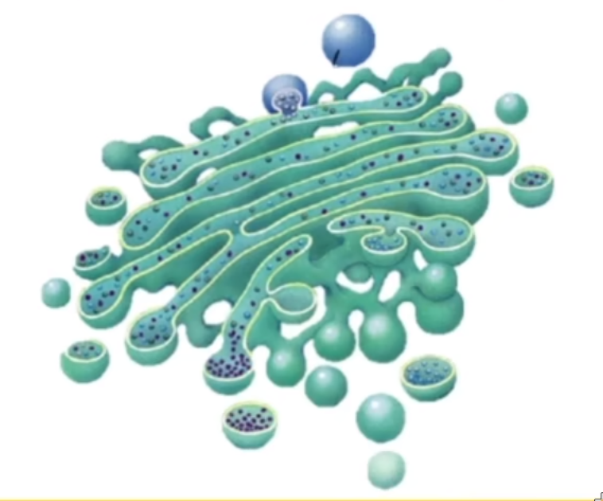

功能:

1. 对来自内质网的蛋白质进行加工、分类和运输
2. 在**动物细胞**内和分泌物的形成有关
3. 在**植物细胞**内和细胞壁的形成有关

在众多细胞器中，其空间和结构：

#### 细胞器之间的协调配合

1. 分泌蛋白

   ​	分泌蛋白是细胞内合成，分泌到细胞外其作用的蛋白质

   ​	例如：唾液淀粉酶、胃蛋白酶等消化酶，抗体和部分激素

2. 分泌蛋白的合成：

   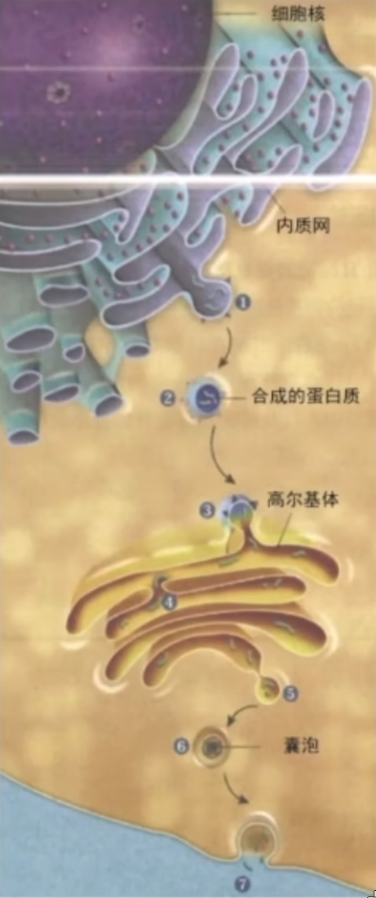

   1. 在游离核糖体中将**氨基酸**合成为变为**多肽**，并逐渐附着到内质网
   2. 肽链进入内质网进行**加工**，内质网形成**囊泡**包裹着运输到**高尔基体**
   3. 囊泡和高尔基体膜融合，高尔基体对蛋白质进行**修饰加工**，高尔基体形成**囊泡**包裹着蛋白质离开
   4. 囊泡与**细胞膜**融合，将蛋白质分泌到细胞外
   5. 全过程需要**线粒体**来提供能量

3. 研究方法：**放射性同位素标记法**

   同位素：质子数相同、中子数不同的元素，中子较多的具有放射性

   ​	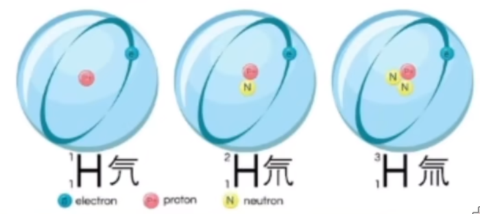

20世纪70年代，科学家詹姆森等在豚鼠的胰腺细胞中注射$^3H$标记的亮氨酸，即将原来的组成元素：C、H、O、N变为C、$^3H$、O、N

3min后被标记的**亮氨酸**出现在附有核糖体的**内质网**中

17min后，出现在**高尔基体**中

117min后，出现在靠近细胞膜内侧的囊泡中及释放到细胞外的分泌物中

由此发现了分泌蛋白的合成与分泌途径：

> 核糖体→内质网→高尔基体→囊泡→细胞膜→外排

**胞外蛋白**合成路径：

其中溶酶体用的水解酶虽然是胞内蛋白，但是路径和胞外蛋白一致

****

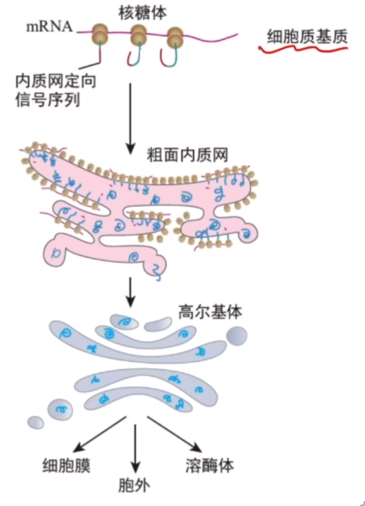

**胞内蛋白**合成路径：

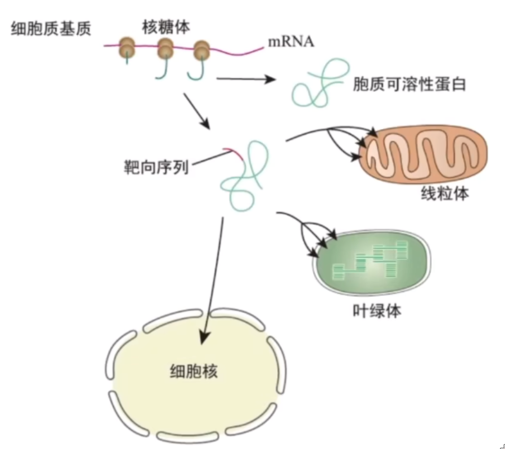

#### 线粒体（双层膜）

大多数呈**短棒状**，**线形**

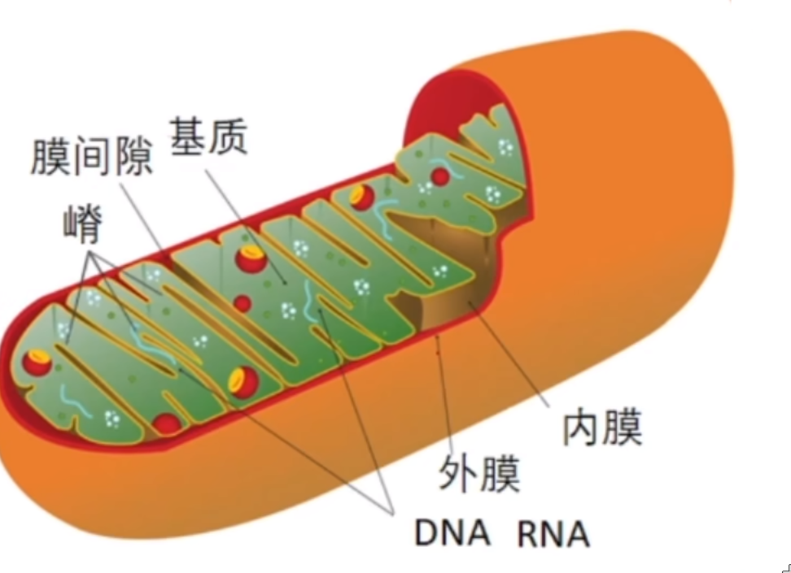

功能：细胞**有氧呼吸**的主要场所

其向内突起部分叫做**嵴**，其作用为增大内膜面积，进而增大了酶的附着位点

其基质中含有：**DNA、RNA、核糖体**

所以它可以自己合成**一部分需要的蛋白质**，属于**半自主细胞器**

其空间和结构，在众多细胞器中：

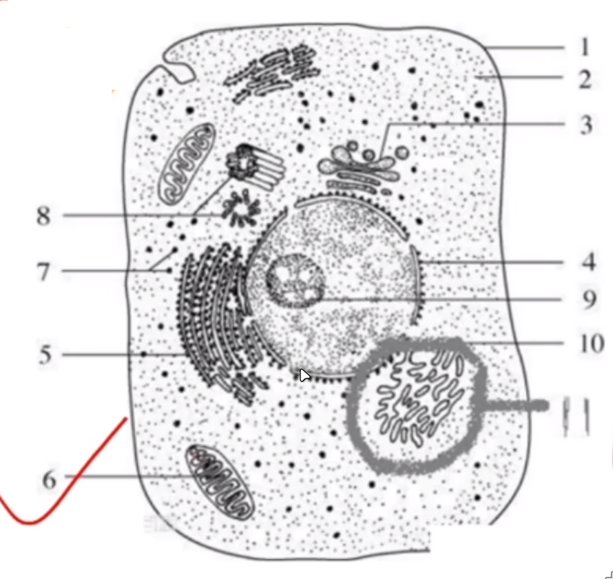

#### 叶绿体（双层膜）

一般呈扁平的椭圆形或球形

功能：**光合作用**场所

其中形如硬币的单片为**类囊体**可以增大反应面积，其中有**光和色素**

类囊体的堆叠体为**基粒**

它的基质中含有**DNA、RNA、核糖体**，所以是**半自主细胞器**

其空间和结构，在众多细胞器中：

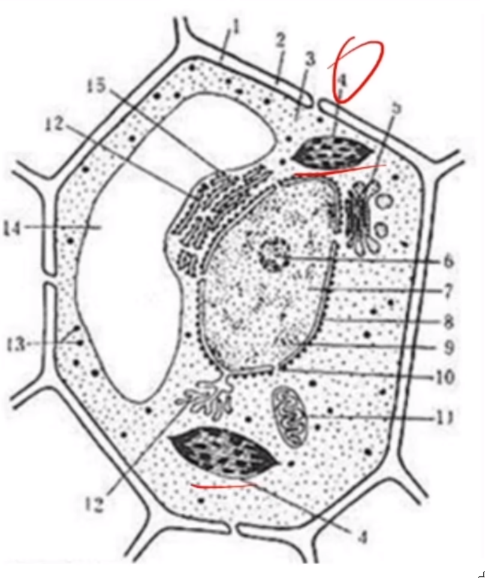

#### 液泡（单层膜）

**成熟植物**才有**中央大液泡**

液泡中的液体称为**细胞液**，其中含有：水、无机盐、色素、糖类、蛋白质等

功能：贮存、调节细胞内环境，充盈的液泡可以让植物细胞保持坚挺

#### 溶酶体（单层膜）

含有多种**水解酶**

功能：分解自身衰老、损伤的细胞器，杀死入侵的细菌和病毒

#### 中心体（无膜）

有两个**相互垂直的中心粒蛋白**和周围物质构成

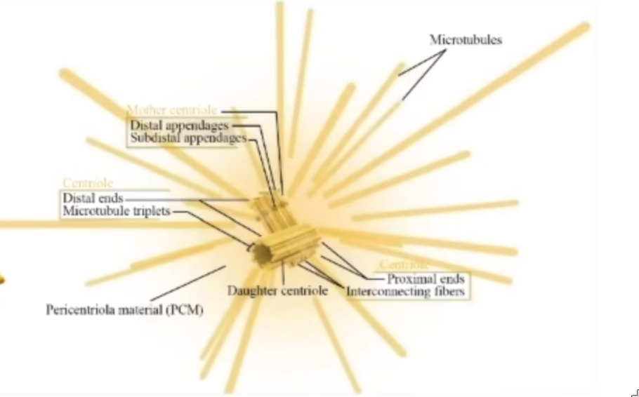

功能：与细胞的**有丝分裂**有关

一般分布于**动物细胞**和**低等植物细胞**（藻类等没有根茎叶分化的植物）中

其空间和结构，在众多细胞器中：

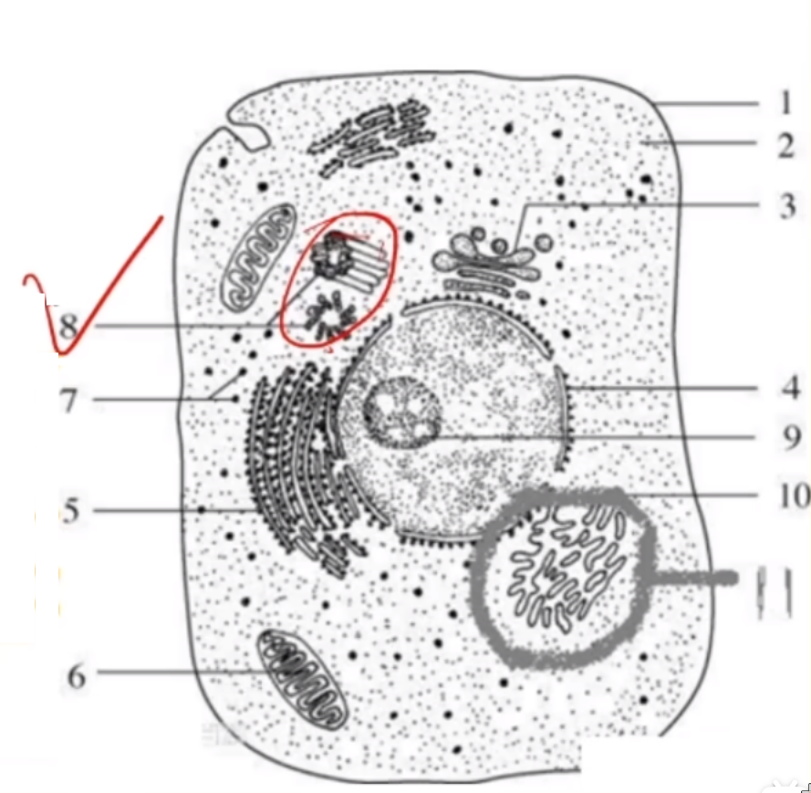

### 细胞核

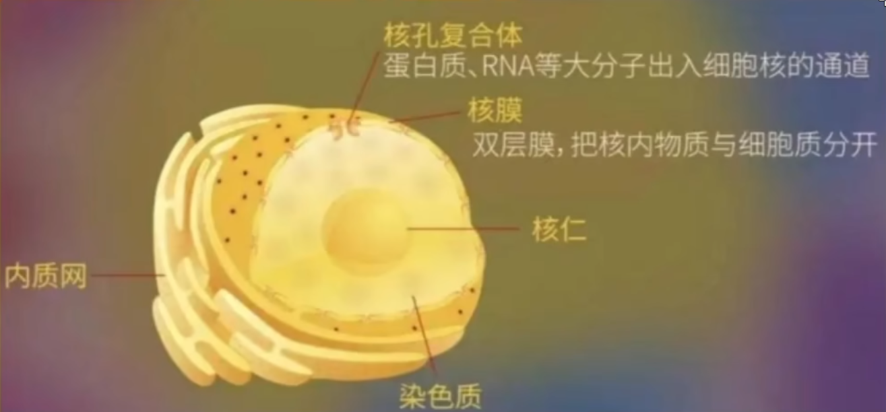

1. 结构：
   1. 核膜：**双层膜**，将细胞质和细胞核分开，控制**小分子物质**的进出
   2. 核孔：核膜上的**通道**，控制**大分子物质**进出
   3. 核仁：可以合成**核糖体RNA**(*rRNA*)与核糖体的形成相关
   4. 染色质：有**DNA**和**蛋白质**构成，与染色体是同种物质的不同形态（细胞分裂时染色质会缠绕成染色体），容易被碱性染料（如龙胆紫）染色而得名
2. 功能

1. 遗传数据库
2. 细胞代谢和遗传的控制中心

### 生物膜系统

生物膜系统由**细胞膜、细胞器膜、核膜**构成，只有**真核细胞**才有生物膜系统

特点：

1. 结构：有**一定的流动性**
2. 功能：有**选择透过性**

功能：

1. 在物质运输、能量转化、信息传递方面起到决定性作用
2. 提供多种酶的附着点位
3. 分隔内外边界，让反应高效、有序地进行.
